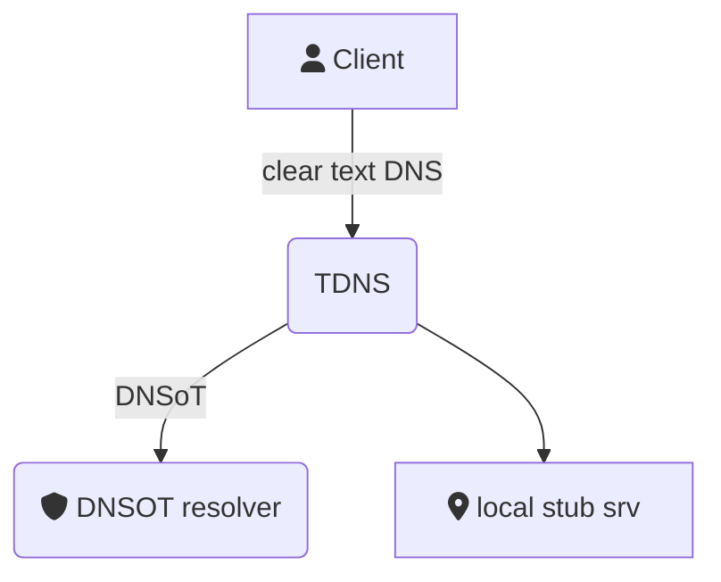

# TDNS

**A DNS over TLS forwarder with caching, black hole, and runtime reconfiguration features.**

TDNS focuses on privacy by acting as a DNS over TLS proxy and DNS sinkhole, preventing data gathering by carriers and
trackers. **It can also route DNS requests to stub servers for local internal networks** in changing environments
like public Wi-Fi, VPNs, or 5G services.

## Features

* Supports TLS and clear DNS upstreams.
* Static host file responses.
* Routes DNS calls to specific domains via stub servers for internal services.
* Zen mode (disables social sites for a period of time).
* Caching.
* Black-hole service (responds with A records to `0.0.0.0` for blacklisted services and supports whitelisting).
* CLI tool.
* REST management API.



## Download

Download from the project releases and add `tdns` to your `$PATH`.

## Quick start


```bash
sudo tdns config -o /etc/tdns -p /etc/tdns
sudo tdns serve -c /etc/tdns/tdns.yaml
```
     
> **[Note]:**  tdns will fail to bind to port 53 if it is already being used, check for network-manager/dnsmasq/etc listening to :53. 

The generated `tdns.yaml` contains the settings needed by both sides of the binary:

* The `server` section used by `tdns serve`.
* The `client` section used by `tdns adm ...` commands.

`tdns` is both the server and the CLI client for the management API.

## Installation bootstrap

Generate a starting configuration directory:

```bash
sudo tdns config -o /etc/tdns -p /etc/tdns
```

That command creates a bootstrap configuration with:

* a self-signed API certificate and private key
* a random HMAC signing key for JWT tokens
* a `tdns.yaml` file with both server and client sections
* a pre-issued client token embedded in `client.token`
* a sample `tdns.service` unit file

If you want to use systemd, review the generated unit file before installing it:

```bash
sudo mv /etc/tdns/tdns.service /etc/systemd/system/tdns.service
sudo systemctl daemon-reload
sudo systemctl enable --now tdns
```

If you prefer to start the server directly:

```bash
sudo tdns serve -c /etc/tdns/tdns.yaml
```

To refresh the embedded frontend before building binaries:

```bash
go generate ./...
go build ./...
```

`go generate ./...` runs the static Nuxt generation step used by the embedded SPA. The release workflow uses the same command before compiling binaries.

## Usage

Show the command surface:

```bash
tdns help
tdns serve --help
tdns config --help
tdns adm help
```

Common server usage:

```bash
tdns serve -c /etc/tdns/tdns.yaml
tdns serve -c /etc/tdns/tdns.yaml -u tls://1.1.1.1:853#cloudflare-dns.com
tdns serve -c /etc/tdns/tdns.yaml -f /etc/hosts -b /etc/tdns/blacklist.hosts
```

For frontend development against a separately running TDNS server:

```bash
cd web
TDNS_API_URL=https://localhost:8443 npm run dev
```

If you do that, enable `cors.enabled` in `tdns.yaml` and set `cors.allowed_origins` to your Nuxt dev origin such as `http://localhost:3000`.

Common admin usage:

```bash
# Enable or disable middleware
tdns adm start blacklist
tdns adm stop blacklist
tdns adm start stub-resolver
tdns adm stop static-response
tdns adm start zen-mode

# Replace runtime data without changing the config file
tdns adm replace --stub 'corp.example,udp://10.0.0.53'
tdns adm replace --zen-domains facebook.com,x.com,instagram.com

# Query and label dnslog data
tdns adm top --since 24h --limit 20
tdns adm alias --hostname laptop --address 192.168.1.20

# Mint a new admin token from a config that has server.signing_key
tdns adm token --exp 365 --sub admin@tdns
```

## Test the server

```bash
dig TXT _status.tdns.local @127.0.0.1
```

If the service is started, point your local DNS configuration to the address on which TDNS listens.

## Upstream format

Configuration files use the upstream concept, which is just a URL with this format:

`proto://address:port#DNS-name`

**Proto**
Either `tcp`, `udp`, or `tls`.

**Address**
IP address of the DNS server.

**Port**
Server port.

**DNS name**
Optional hostname expected in the upstream TLS certificate. If set, TDNS verifies the certificate against this name.

## Configuration reference

Configuration can come from the YAML file and, for a subset of options, from CLI flags on `tdns serve`.
The main runtime options currently used by the server are:

### Top-level options

| key | description |
| --- | --- |
| `timeout` | Global DNS request timeout in milliseconds. |
| `upstream_timeout` | Timeout for upstream DNS calls in milliseconds. |
| `verify_tls` | Whether to verify upstream TLS certificates. |
| `loglevel` | Log level such as `INFO`, `DEBUG`, or `ERROR`. |
| `upstreams` | Default upstream resolvers. |

### `blacklist`

| key | description |
| --- | --- |
| `blacklist.enabled` | Enables blacklist middleware. |
| `blacklist.file` | Local hosts-style blacklist file. |
| `blacklist.external_file` | Path inside the external repo to pull from. |
| `blacklist.external_repo` | Remote repo used for scheduled updates. |
| `blacklist.external_pull_period` | Cron expression for external blacklist refresh. |
| `blacklist.excludes` | Domains to keep out of the blacklist. |

### `static_response`

| key | description |
| --- | --- |
| `static_response.enabled` | Enables static-response middleware. |
| `static_response.file` | Hosts-style file used for static answers. |

### `zen_mode`

| key | description |
| --- | --- |
| `zen_mode.enabled` | Enables zen mode middleware. |
| `zen_mode.file` | Optional hosts-style file loaded into zen mode. |
| `zen_mode.domains` | Domains blocked when zen mode is active. |
| `zen_mode.time` | Zen mode duration in minutes. |

### `stub_resolver`

| key | description |
| --- | --- |
| `stub_resolver.enabled` | Enables stub resolution middleware. |
| `stub_resolver.stubs` | Domain-to-upstream mappings like `example.com,udp://10.0.0.53`. |

### `database`

| key | description |
| --- | --- |
| `database.file` | Shared SQLite database path used by DNS log, aliases, and tagger data. |

### `cors`

| key | description |
| --- | --- |
| `cors.enabled` | Enables cross-origin API access for development or external SPA hosting. |
| `cors.allowed_origins` | Explicit origins allowed when CORS is enabled. If empty, TDNS allows any origin. |

### `dns_log`

| key | description |
| --- | --- |
| `dns_log.enabled` | Enables DNS query logging. |
| `dns_log.purge` | Retention window used by the scheduled purge task. |

### `tagger`

| key | description |
| --- | --- |
| `tagger.enabled` | Enables the tagger middleware. |

### `status`

| key | description |
| --- | --- |
| `status.enabled` | Enables `_status.tdns.local` replies. |
| `status.expose_stats` | Includes cache statistics in the TXT response. |
| `status.expose_uptime` | Includes uptime data in the TXT response. |

### `server`

| key | description |
| --- | --- |
| `server.listen_addr` | DNS listener address, for example `:53` or `127.0.0.1:8053`. |
| `server.api_addr` | HTTPS API listener address, for example `:8443`. |
| `server.api_cert_file` | TLS certificate used by the REST API. |
| `server.api_key_file` | TLS private key used by the REST API. |
| `server.pprof_addr` | Optional pprof HTTP listener, for example `:6060`. |
| `server.signing_key` | Base64-encoded HMAC key used to sign admin JWT tokens. |

### `client`

| key | description |
| --- | --- |
| `client.server` | Base HTTPS URL of the remote TDNS API, for example `https://tdns.example.com:8443`. |
| `client.ca_cert` | CA or self-signed certificate trusted by the CLI client. |
| `client.token` | Bearer token used by `tdns adm ...` commands. |

### CLI flags on `tdns serve`

| flag | config key | description |
| --- | --- | --- |
| `-u`, `--upstream` | `upstreams` | Override default upstreams. |
| `-s`, `--stub` | `stub_resolver.stubs` | Override stub definitions. |
| `-f`, `--hosts` | `static_response.file` | Override static hosts file. |
| `-b`, `--blacklist` | `blacklist.file` | Override blacklist file. |
| `-z`, `--zenfile` | `zen_mode.file` | Override zen mode file. |
| `-T`, `--zentime` | `zen_mode.time` | Override zen mode duration in minutes. |
| `-t`, `--timeout` | `timeout` | Override global timeout in milliseconds. |
| `-U`, `--upstreamtimeout` | `upstream_timeout` | Override upstream timeout in milliseconds. |
| `-c`, `--configfile` | n/a | Path to the YAML config file. |
| `-v`, `--verbose` | n/a | Enable verbose logging. |

## Certificates and hostnames

The REST API is always HTTPS. The certificate used by the API server comes from `server.api_cert_file` and `server.api_key_file`.
The `tdns config` command generates a self-signed certificate, and the `-H/--hosts` values become certificate SANs.

If you want the server certificate to be valid for a specific hostname, generate the bootstrap with that hostname:

```bash
tdns config \
  -o /etc/tdns \
  -p /etc/tdns \
  -l 0.0.0.0:53 \
  -a 0.0.0.0:8443 \
  -H tdns.example.com \
  -H 203.0.113.10
```

That makes the generated certificate valid for both `tdns.example.com` and `203.0.113.10`.

Then make sure the generated config points the embedded client at the same hostname used in the certificate:

```yaml
client:
  server: https://tdns.example.com:8443
```

If you connect by IP address instead of hostname, include that IP in `-H` when generating the certificate.

## Remote client configuration

Because `tdns config` writes one YAML file for both roles, the easiest way to bootstrap a remote client is:

1. Run `tdns config` on the server host.
2. Keep the generated `server.*` section on the server.
3. Copy the certificate named in `client.ca_cert` to the remote machine.
4. Copy the `client` section, or create a minimal client-only config there.

A minimal remote client config looks like this:

```yaml
client:
  server: https://tdns.example.com:8443
  ca_cert: /etc/tdns/tdns_cert.pem
  token: <jwt token>
```

You can reuse the token generated by `tdns config`, or issue a new one on the server with:

```bash
tdns adm token --exp 365 --sub remote-admin@tdns
```

That token must be created from a config that contains the server `signing_key`.

## REST API

REST calls require:

* HTTPS to the address configured in `server.api_addr`
* a bearer token signed with `server.signing_key`
* the CA or self-signed certificate trusted by the client

The current OpenAPI description is available at [api/openapi.yaml](api/openapi.yaml).

## Getting black hole lists

TDNS uses plain hosts files, usually pointing to `0.0.0.0`. Various projects provide quality hosts files.
TDNS has been tested with data from `stevenblack/hosts`. TDNS ignores the IP in the hosts file and uses `0.0.0.0`
as the sinkhole answer.

## History

tdns started as shell script that used to manage dnsmask over dbus in order to activate/deactivate on demand so that I could have multiple VPNs fast, also I hated to send all the internet traffic over the slow VPN, when downloading public images, so with some scripting and linux Cgroups I achieved
having a cgroup using normal internet and the rest using the VPN that was publishing a 0/0 route through itself, tdns was needed in order to make this dynamic on post connect scripts.

Over the time it became bloated, default DNS was a localhost instance of stubby for DNS over TLS, and a pit  of python for dbus scripting, after that I added some black listing and my "zen" where I block for some hours all social stuf, directly on my home router.

Too bloated for a shell script, but existing solutions lacked the dynamic reconfiguration so I re-wrote it aas a go program I have being using this for years now.  