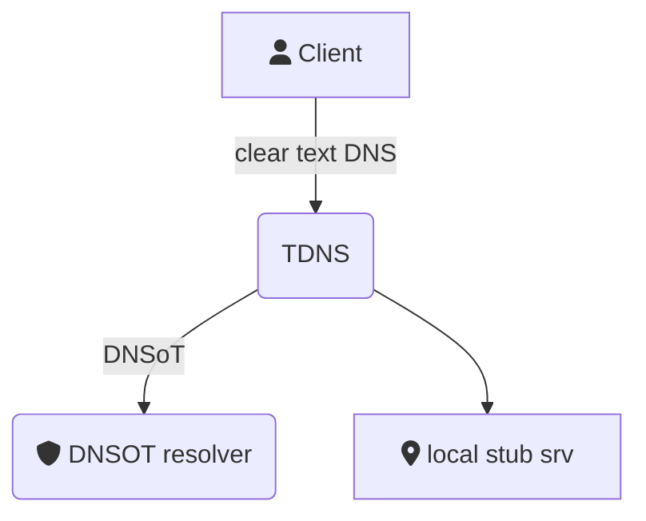

# TDNS
 
**A DNS over TLS forwarder with caching, black hole, and runtime reconfiguration features.**

TDNS focuses on privacy, it is a DNS over TLS proxy, that can act as a DNS sinkhole to improve privacy network-wide and
prevents data gathering by carriers and trackers. 

It can also broke DNS requests to stub servers for local internal networks in changing scenarios, like public Wi-Fi, VPN or 5G services.

## Features

* Supports TLS and clear DNS upstreams.
* Static host file responses.
* Routes DNS calls to specific domains via stub servers for internal services.
* Zen mode (disable social sites for a period of time).
* Caching.
* Black-hole service, responds with A records to 0.0.0.0 to black listed services, also supports white listing.
* Cli tool.
* ReST management API.




# Download

Download from here: TDB and add it to your `$PATH`. 


## Quick start

TODO: release link

```
$ curl XXXXX -o ~/bin/tdns && chmod +x ~/bin/tdns
$ export PATH=$PATH:~/bin
$ curl http://sbc.io/hosts/hosts -o /tmp/bhole.hosts
$ sudo tdns serve -f /etc/hosts -b /tmp/bhole.hosts

```

## Install 

### Generate configuration bootstrap

The `config` sub-command will generate a sample configuration directory as well as a systemd entry.

`$ tdns config -o ./sample -path /etc/tdns`


```bash 
$ sudo mv ./sample /etc/tdns
$ sudo mv /etc/tdns/tdns.service /etc/systemd/system/tdns.service
$ sudo systemctl config-reload
$ sudo systemctl start tdns

```
Just review the files and move it, the `-o` switch will template the configuration path 
for the generated files.

If the service is started, change your local DNS configuration to the address on which 
TDNS listens to, the default is 127.0.0.1.

you can interact with the service via the ``tdns`` command, see `tdns help` and `tdns adm help`.

## Getting black hole lists

TDNS uses plain hosts files, usually pointing to 0.0.0.0, there are plenty projects providing quality hosts files, TDNS was tested with stevenblack/hosts produced files, you can test pulling http://sbc.io/hosts/hosts your your milestone may vary, at the end of the day TDNS used standard Unix hosts files, it ignores the IP address and uses 0.0.0.0 as the sink hole.

## Upstream format

Configuration files have the upstream concept, which is just a URL, the format is:

`proto://address:port#DNS-name`

**Proto:**
  Either TCP, UDP, or TLS
**Address:**
  IP address for the DNS server
**Port:**
  Server port
**DNS name (optional):**
  Named host allowed in the certificate, if this is set, then the certificate will be checked for this host name to be present. 


## Configuration options

Some configuration options can be set by command line options for the `tdns serve` command, all the rest can be set either by environment variables or configfile file option, the override order is cli, env, then config file.

### server options:

| cfg 	| env 	| cli 	| description 	|
|-----	|-----	|-----	|-------------	|
|timeout | TDNS_TIMEOUT    	|     	|             	|
|verify_tls | TDNS_VERIFY_TLS  	|     	|             	|
|upstreams| TDNS_UPSTREAM    	|    -u, --upstream 	|             	|
|enable_blackhole   | TDNS_ENABLE_BLACKHOLE     ||
|blackhole_file |  TDNS_BLACKHOLE_FILE    | -b, --blackhole |
|blackhole_exempt |TDNS_BLACKHOLE_EXEMPT      ||
|enable_static_response| TDNS_ENABLE_STATIC_RESPONSE       ||
|static_response_file|  TDNS_STATIC_RESPONSE_FILE     | -f, --hosts|
|enable_zenmode| TDNS_ENABLE_ZENMODE ||
|zenmode_file|  TDNS_ZENMODE_FILE    | -z, --zenfile|
|zenmode_domains| TDNS_ZENMODE_DOMAINS     ||
|zenmode_time| TDNS_ZENMODE_TIME     |-t, -zentime| |
|enable_stubs| TDNS_ENABLE_STUBS     ||
|stubs|      TDNS_STUBS| -s, --stub | |


### server opts

listen_addr 
api_addr 
api_cert_file
api_key_file
signing_key


### client opts

token:
server: 
ca_cert: 


## ReST API and tdns client

Making rest calls will require a TLS connection and a JWT token, tokens can be generated with `tdns adm token` command, 
the server certificate will be needed if it is serf signed, the default configuration creates a self signed certificate and key
similar equivalent to the ones created by the following command:


```
openssl req -x509 -newkey ec -pkeyopt ec_paramgen_curve:secp384r1 -days 3650 \
  -nodes -keyout fixtures/tdns.key -out fixtures/tdns.crt -subj "/CN=tdns.kubewire.net" \
  -addext "subjectAltName=DNS:localhost,DNS:*.example.com,IP:127.0.0.1"

```

So the connection between tdns client to the server is always TLS based and authorized by a long lasting JWT token which
is validated with an HMAC signature, you can create such tokens with the `tdns adm token` command, this way you can control 
tdns runtime features remotely either by issuing rest commands or with the built in client.