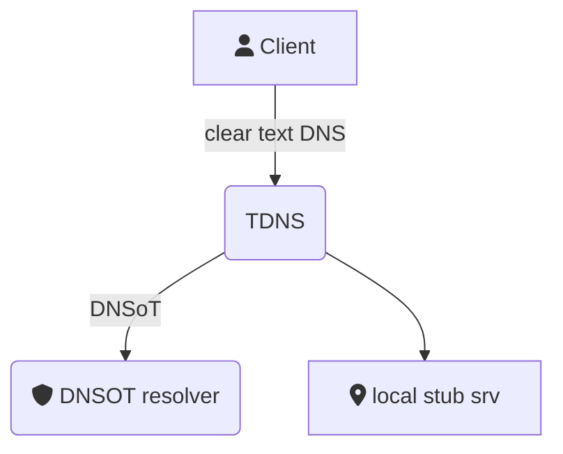

# TDNS
 
**A DNS over TLS forwarder with caching, black hole, and runtime reconfiguration features.**

TDNS focuses on privacy by acting as a DNS over TLS proxy and DNS sinkhole, preventing data gathering by carriers and trackers. **It can also route DNS requests to stub servers for local internal networks** in changing environments like public Wi-Fi, VPNs, or 5G services.

## Features

* Supports TLS and clear DNS upstreams.
* Static host file responses.
* Routes DNS calls to specific domains via stub servers for internal services.
* Zen mode (disables social sites for a period of time).
* Caching.
* Black-hole service (responds with A records to 0.0.0.0 for blacklisted services and supports whitelisting).
* CLI tool.
* REST management API.




# Download

Download from here: TDB and add it to your `$PATH`. 


## Quick start

TODO: release link

```
$ curl XXXXX -o ~/bin/tdns && chmod +x ~/bin/tdns
$ export PATH=$PATH:~/bin
$ curl http://sbc.io/hosts/hosts -o /tmp/bhole.hosts
$ sudo tdns serve -f /etc/hosts -b /tmp/bhole.hosts

```

## Install 

### Generate configuration bootstrap

The `config` sub-command will generate a sample configuration directory and systemd entry.

```bash 
`$ tdns config -o ./sample -path /etc/tdns`
$ sudo mv ./sample /etc/tdns
$ sudo mv /etc/tdns/tdns.service /etc/systemd/system/tdns.service
$ sudo systemctl config-reload
$ sudo systemctl start tdns
```

### Test the server 

```bash
$ dig TXT status.tdns.local @127.0.0.1 
```

If the service is started, change your local DNS configuration to the address on which TDNS listens (default is 127.0.0.1). Interact with the service using the tdns command (``tdns help``  and ``tdns adm help``).


## Getting black hole lists

TDNS uses plain hosts files, usually pointing to 0.0.0.0. Various projects provide quality hosts files. TDNS has been tested with files from stevenblack/hosts. You can test by pulling http://sbc.io/hosts/hosts. TDNS uses standard Unix hosts files, ignoring the IP address and using 0.0.0.0 as the sinkhole.

## Upstream format

Configuration files use the upstream concept, which is just a URL, the format is:

`proto://address:port#DNS-name`

**Proto:**
  Either TCP, UDP, or TLS
**Address:**
  IP address of the DNS server
**Port:**
  Server port
**DNS name (optional):**
  Named host allowed in the certificate; if set, the certificate will be checked for this host name. 


## Configuration options

Some configuration options can be set via command line for the tdns serve command. Others can be set via environment variables or configuration files. The override order is CLI, env, then config file.

### server options:

| cfg 	| env 	| cli 	| description 	|
|-----	|-----	|-----	|-------------	|
|timeout | TDNS_TIMEOUT    	|     	|             	|
|verify_tls | TDNS_VERIFY_TLS  	|     	|             	|
|upstreams| TDNS_UPSTREAM    	|    -u, --upstream 	|             	|
|enable_blackhole   | TDNS_ENABLE_BLACKHOLE     ||
|blackhole_file |  TDNS_BLACKHOLE_FILE    | -b, --blackhole |
|blackhole_exempt |TDNS_BLACKHOLE_EXEMPT      ||
|enable_static_response| TDNS_ENABLE_STATIC_RESPONSE       ||
|static_response_file|  TDNS_STATIC_RESPONSE_FILE     | -f, --hosts|
|enable_zenmode| TDNS_ENABLE_ZENMODE ||
|zenmode_file|  TDNS_ZENMODE_FILE    | -z, --zenfile|
|zenmode_domains| TDNS_ZENMODE_DOMAINS     ||
|zenmode_time| TDNS_ZENMODE_TIME     |-t, -zentime| |
|enable_stubs| TDNS_ENABLE_STUBS     ||
|stubs|      TDNS_STUBS| -s, --stub | |


### server opts

listen_addr 
api_addr 
api_cert_file
api_key_file
signing_key


### client opts

token:
server: 
ca_cert: 


## ReST API and tdns client

REST calls require a TLS connection and a JWT token. Tokens can be generated with the tdns adm token command. The server certificate is needed if it is self-signed. The default configuration creates a self-signed certificate and key, similar to those created by:

```
openssl req -x509 -newkey ec -pkeyopt ec_paramgen_curve:secp384r1 -days 3650 \
  -nodes -keyout fixtures/tdns.key -out fixtures/tdns.crt -subj "/CN=tdns.kubewire.net" \
  -addext "subjectAltName=DNS:localhost,DNS:*.example.com,IP:127.0.0.1"
```

The connection between the TDNS client and the server is always TLS-based and authorized by a long-lasting JWT token validated with an HMAC signature. You can create such tokens with the ``tdns adm token`` command to control TDNS runtime features remotely, either by issuing REST commands or with the built-in client.

### TBD: curl example, swagger.