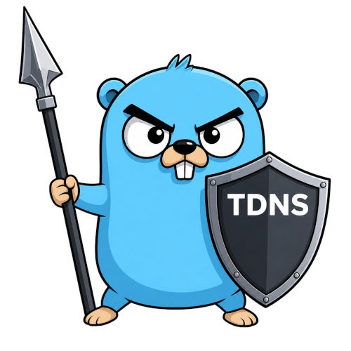

# TDNS Documentation

TDNS is a single-binary DNS forwarder for trusted home, LAN, and VPN networks.
It combines encrypted upstream resolution, caching, blocklists, split DNS,
runtime administration, and an embedded web interface.

Use these sections as the starting points:

- **[Installing](installing/)** covers binary, systemd, Docker, and initial
  configuration.
- **[Security](security/)** summarizes the supported trust boundary and links
  to the living security policy.
- **[Contributing](contributing/)** covers the development toolchain, tests,
  generated files, and documentation preview.
- **[Web Interface](web-interface/)** explains access, login, sessions, and
  Swagger.

For every recognized YAML option, see the
[configuration reference](configuration.md).

> TDNS is intended for one instance on a trusted network. Do not expose its DNS
> or management listeners directly to the Internet.
